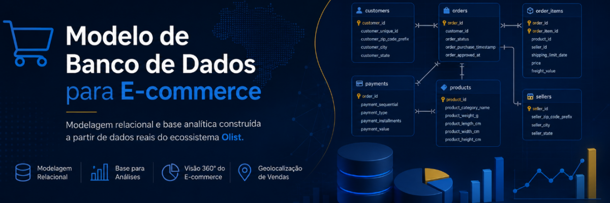
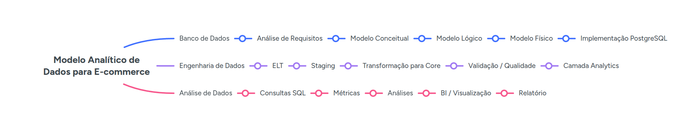

<!-- Cabeçalho -->



<h2 align="center">
<em>Modelo Analítico de Dados para E-commerce</em>
</h2>

## Descrição

Este projeto tem como objetivo desenvolver um modelo de dados relacional para apoiar a exploração e a análise multidimensional de operações de comércio eletrônico.

A partir do conjunto de dados público **Brazilian E-Commerce Public Dataset by Olist**, o projeto organiza e relaciona informações de clientes, pedidos, itens, produtos, vendedores, pagamentos, avaliações e geolocalização. A estrutura resultante busca fornecer uma base consistente para análises comerciais, comportamentais, financeiras, geográficas e relacionadas ao processo de entrega.

O trabalho reproduz, em escala de projeto, etapas recorrentes no desenvolvimento profissional de soluções de dados: análise de requisitos, compreensão e validação das fontes, modelagem conceitual, modelagem lógica, modelagem física, implementação do banco de dados, carga e preparação dos dados e posterior disponibilização dos dados para consultas e análises.

Atualmente, as etapas de modelagem e implementação da estrutura física estão concluídas. O projeto está na fase de **carga de dados**, cobrindo contratos de ingestão, mapeamento RAW → CORE, regras de qualidade, implementação e reconciliação do ELT.

## Objetivos

- Levantar e documentar os requisitos do domínio de e-commerce;
- Compreender a estrutura, a granularidade e a qualidade dos dados disponibilizados;
- Identificar entidades, atributos, relacionamentos, cardinalidades e regras de negócio;
- Desenvolver os modelos conceitual, lógico e físico do banco de dados;
- Garantir integridade, consistência e rastreabilidade das decisões de modelagem;
- Integrar as diferentes entidades do dataset em uma estrutura relacional coerente;
- Implementar uma base de dados adequada para consultas e análises multidimensionais de e-commerce.

## Escopo

O projeto contempla a modelagem de dados relacionados a:

- Clientes;
- Pedidos e seus status;
- Itens dos pedidos;
- Produtos e categorias;
- Vendedores;
- Pagamentos;
- Avaliações de clientes;
- Datas e prazos associados ao processamento e à entrega dos pedidos;
- Informações geográficas e dados de geolocalização associados aos prefixos de CEP.

Não fazem parte do escopo o desenvolvimento de uma plataforma transacional de e-commerce, o processamento em tempo real, o gerenciamento operacional de estoque, o rastreamento físico de pedidos ou a gestão de transportadoras, veículos, motoristas e rotas.

Também não são utilizados dados pessoais sensíveis nem informações que permitam a identificação direta dos consumidores.

## Estrutura do repositório

```text
.
├── data/
│   ├── README.md
│   └── raw/                         # CSVs originais, não versionados
│
├── docs/
│   ├── requirements/                # Análise e documentação de requisitos
│   ├── WORKFLOW.md                  # Regras do fluxo de desenvolvimento
│   ├── data-loading/                # Contratos e documentação da carga
│   │   ├── raw_ingestion_contract.md
│   │   ├── raw_to_core_mapping.md
│   │   ├── data_quality_rules.md
│   │   ├── raw_load_pipeline.md
│   │   └── core_load_pipeline.md
│   └── modeling/
│       ├── conceptual/              # Documentação da modelagem conceitual
│       │   ├── conceptual_model.tex
│       │   ├── conceptual_model.pdf
│       │   └── mer/                 # Representação exportada do MER
│       │
│       ├── logical/                 # Documentação da modelagem lógica
│       │   ├── logical_model.tex
│       │   ├── logical_model.pdf
│       │   └── model/               # Representação gráfica do modelo lógico
│       │
│       └── physical/                # Documentação consolidada da modelagem física
│
├── models/
│   ├── README.md
│   ├── conceptual/                  # Artefatos técnicos do modelo conceitual
│   │   └── mer-olist-conceitual.drawio
│   ├── logical/                     # Artefatos técnicos do modelo lógico
│   │   └── logical_schema.dbml
│   └── physical/                    # DDL, índices e validações para PostgreSQL
│
├── notebooks/
│   ├── data-modeling/               # Validações e evidências da modelagem
│   │   ├── 01_validacao_entidades.ipynb
│   │   ├── 02_validacao_atributos.ipynb
│   │   ├── 03_validacao_relacionamentos.ipynb
│   │   ├── 04_validacao_cardinalidades.ipynb
│   │   └── 05_validacao_prefixo_cep.ipynb
│   └── data-loading/                # Evidências reproduzíveis da carga
│       ├── 01_raw_source_profiling.ipynb
│       └── 02_raw_to_core_quality_validation.ipynb
│
├── config/
│   ├── raw_load.toml                # Contrato operacional da ingestão RAW
│   ├── core_load.toml               # Configuração da transformação CORE
│   └── raw_load.env.example         # Exemplo de variável de conexão
│
├── etl/
│   ├── raw_loader.py                # Pipeline transacional da camada RAW
│   ├── core_loader.py               # Transformação e reconciliação CORE
│   ├── pipeline.py                  # Orquestração atômica completa
│   └── sql/load_core.sql            # SQL RAW → CORE
│
├── scripts/                         # Fontes Jupytext locais, não versionadas
│   ├── data-modeling/
│   └── data-loading/
│
├── tests/
│   ├── test_raw_loader.py           # Testes automatizados da ingestão
│   └── test_core_loader.py          # Testes das transformações CORE
│
├── .github/
├── .gitignore
├── .python-version
├── AGENTS.md
├── CONTRIBUTING.md
├── LICENSE
├── README.md
├── pyproject.toml                   # Metadados e dependências do projeto
└── uv.lock                          # Dependências com versões reproduzíveis
```

A estrutura poderá evoluir conforme novos artefatos forem desenvolvidos.

O diretório `scripts/` existe apenas no ambiente local e é ignorado pelo Git. Os notebooks sincronizados em `notebooks/` constituem os artefatos versionados utilizados para registrar as validações e as evidências empíricas que sustentam as decisões de modelagem.

## Road map



## Configuração do ambiente

O projeto utiliza [uv](https://docs.astral.sh/uv/) para gerenciar a versão do Python, o ambiente virtual e as dependências.

Com o `uv` instalado, sincronize o ambiente:

```bash
uv sync --locked --all-groups
```

Para abrir os notebooks:

```bash
uv run jupyter lab
```

### Fluxo de trabalho com Jupytext

Os notebooks possuem uma representação pareada em Python no formato `py:percent`. O desenvolvimento é realizado localmente nos arquivos do diretório `scripts/data-modeling/`, utilizando células delimitadas por `# %%` no VS Code.

Após alterar um script, sincronize o notebook correspondente:

```bash
uv run jupytext --sync scripts/data-modeling/01_validacao_entidades.py
```

O pareamento mantém a seguinte correspondência:

```text
scripts/data-modeling/<arquivo>.py
                    ↕ Jupytext
notebooks/data-modeling/<arquivo>.ipynb
```

Os arquivos Python de `scripts/` permanecem apenas no ambiente local. Os notebooks `.ipynb` correspondentes são os artefatos incluídos nos commits.

## Dados

Os arquivos CSV originais não são armazenados no Git.

### Ingestão da camada RAW

Valide os nove arquivos sem acessar o banco:

```bash
uv run python -m etl.raw_loader --validate-only
```

Para executar o pipeline completo, configure `DATABASE_URL` no ambiente local:

```bash
uv run python -m etl.pipeline
```

O processo é transacional, substitui a carga RAW anterior somente após a
reconciliação completa e grava logs locais ignorados pelo Git. Consulte
[a documentação da RAW](docs/data-loading/raw_load_pipeline.md) e
[a documentação do pipeline completo](docs/data-loading/core_load_pipeline.md) para
configuração, operação e diagnóstico.

Consulte [data/README.md](data/README.md) para obter as instruções de download do dataset e preparação do diretório `data/raw/`.

Fonte: [Brazilian E-Commerce Public Dataset by Olist](https://www.kaggle.com/datasets/olistbr/brazilian-ecommerce).

## Metodologia

O desenvolvimento segue uma abordagem incremental, na qual cada camada da modelagem deriva das decisões e evidências produzidas anteriormente:

```text
Análise de requisitos
        ↓
Entendimento e validação dos dados
        ↓
Modelo conceitual
        ↓
Modelo lógico relacional
        ↓
Modelo físico
        ↓
Implementação do banco de dados
        ↓
Carga e preparação dos dados
        ↓
Consultas e análises
```

A modelagem conceitual estabelece as entidades, atributos, identificadores, relacionamentos e cardinalidades do domínio. A modelagem lógica converte essa estrutura para o paradigma relacional, definindo tabelas, chaves, restrições de integridade, nomenclatura e dependências entre os dados sem vincular o modelo a decisões específicas de implementação.

A modelagem física traduziu o modelo lógico para PostgreSQL 18 e materializou uma arquitetura ELT com os schemas `raw`, `core` e `analytics`. A camada RAW possui uma tabela para cada CSV de origem; a CORE implementa as nove tabelas relacionais, suas restrições e os índices iniciais aprovados; a ANALYTICS permanece reservada para entregas analíticas posteriores.

A etapa atual prepara a carga reproduzível do dataset. Ela começa pelo inventário e pelo perfil técnico dos arquivos de origem, avança para o mapeamento RAW → CORE, define regras de qualidade e transformação e, por fim, executa e reconcilia a carga. As entregas dessa etapa devem preservar a rastreabilidade entre os CSVs, as tabelas RAW e o modelo CORE.

O trabalho é planejado no [GitHub Project](https://github.com/users/LUCASDNORONHA/projects/6). As regras de status, prioridade, iteração e conclusão estão descritas em [docs/WORKFLOW.md](docs/WORKFLOW.md), enquanto o fluxo de contribuição está documentado em [CONTRIBUTING.md](CONTRIBUTING.md).

## Autor

Lucas Dias Noronha

## Licença

Este projeto está licenciado sob os termos da [MIT License](LICENSE).